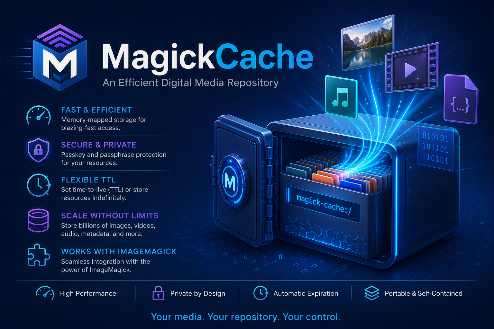

# MagickCache: An Efficient Digital Media Repository

[](https://github.com/ImageMagick/MagickCache/actions)
[](https://github.com/sponsors/ImageMagick)



MagickCache is a free and open-source high-performance repository for securely storing images, image sequences, video, audio, metadata, and arbitrary binary content. Resources are memory-mapped for fast access, and image retrieval can be limited to a specific region for additional efficiency.

Resources may be stored permanently or assigned a time-to-live (TTL), after which they can be automatically expire. A single MagickCache repository can scale to billions of resources, making it suitable for digital media archiving, asset management, and content delivery workloads.

MagickCache works in concert with [ImageMagick](https://imagemagick.org). Download and install [MagickCache](https://github.com/ImageMagick/MagickCache), then create and populate a repository with your media and metadata.

## Create a Digital Media Repository

You will need a location to store and retrieve your content. Create a digital media repository on your local filesystem:

```sh
magick-cache -passkey ~/.passkey create /opt/dmr
```

Where `~/.passkey` contains your repository passkey. The passkey can contain any binary content, including a password, phrase, image, or random data. The passkey is sensitive to all characters, including control characters.

One way to create a passkey without control characters is:

```sh
echo -n "myPasskey" > ~/.passkey
```

For best results, use a passkey of at least eight characters. Keep it safe. Without the passkey, you cannot identify, delete, or expire resources in the repository.

For the lowest latency and best performance, store your repository on an SSD.

You only need to create a repository once. A single MagickCache repository can store billions of images, videos, audio files, blobs, and metadata resources. You may also create multiple repositories if desired.

## Put Content in the Digital Media Repository

Let's add a cast image to the repository:

```sh
magick-cache put /opt/dmr movies/image/mission-impossible/cast/rebecca-ferguson 20240508-rebecca-ferguson.jpg
```

Note that the image identifier is an IRI composed of `project/type/resource-path`. In this example, the project is `movies`, the type is `image`, and the resource path is `mission-impossible/cast/rebecca-ferguson`.

Each resource path should uniquely identify a resource. If you need multiple versions of the same image, use distinct identifiers.

Set a resource passkey and a TTL of two days:

```sh
magick-cache -passkey ~/.passkey -ttl "2 days" put /opt/dmr movies/image/mission-impossible/cast/rebecca-ferguson 20240508-rebecca-ferguson.jpg
```

After two days, the resource can be removed with the `expire` command.

To prevent the repository owner from viewing image content, scramble the image with a passphrase:

```sh
magick-cache -passkey ~/.passkey -passphrase ~/.passphrase -ttl "2 days" put /opt/dmr movies/image/mission-impossible/cast/rebecca-ferguson 20240508-rebecca-ferguson.jpg
```

The same passphrase is required when retrieving the image.

Only image resources are scrambled. Blob and metadata resources are stored as-is. If additional privacy is required, encrypt or obfuscate those resources before storing them.

## Get Content from the Digital Media Repository

Eventually you will want to retrieve your content:

```sh
magick-cache -passkey ~/.passkey get /opt/dmr movies/image/mission-impossible/cast/rebecca-ferguson rebecca-ferguson.png
```

The original image is stored as JPEG but is converted to PNG during retrieval.

To extract only a portion of an image:

```sh
magick-cache -passkey ~/.passkey -extract 100x100+0+0 get /opt/dmr movies/image/mission-impossible/cast/rebecca-ferguson rebecca-ferguson.png
```

To resize the image during retrieval, omit the offset:

```sh
magick-cache -passkey ~/.passkey -extract 100x100 get /opt/dmr movies/image/mission-impossible/cast/rebecca-ferguson rebecca-ferguson.png
```

If the image was scrambled, provide the passphrase:

```sh
magick-cache -passkey ~/.passkey -passphrase ~/.passphrase get /opt/dmr movies/image/mission-impossible/cast/rebecca-ferguson rebecca-ferguson.png
```

## Delete Content from the Digital Media Repository

Delete a specific resource:

```sh
magick-cache -passkey ~/.passkey delete /opt/dmr movies/image/mission-impossible/cast/rebecca-ferguson
```

Delete expired resources under a path:

```sh
magick-cache -passkey ~/.passkey expire /opt/dmr movies/image/mission-impossible/cast
```

## Identify Repository Content

```sh
magick-cache -passkey ~/.passkey identify /opt/dmr movies/image/mission-impossible/cast
```

Each entry includes the IRI, image dimensions (for images), content size, TTL, expiration status, and creation date.

MagickCache also supports wildcard resource types:

```sh
magick-cache -passkey ~/.passkey identify /opt/dmr movies/*/mission-impossible/cast
```

Other users may store content alongside yours. However, you cannot get, identify, delete, or expire resources that were created with a different passkey.

The repository owner can access all resources:

```sh
magick-cache -passkey ~/.passkey identify /opt/dmr /
```

Expired resources are marked with an asterisk (`*`).

## MagickCache Is Not Just for Images

You can store video, audio, metadata, or arbitrary files using the `blob` and `meta` resource types:

```sh
magick-cache -passkey ~/.passkey put /opt/dmr movies/blob/mission-impossible/cast/rebecca-ferguson 20240508-rebecca-ferguson.mp4
```

```sh
magick-cache -passkey ~/.passkey put /opt/dmr movies/meta/mission-impossible/cast/rebecca-ferguson 20240508-rebecca-ferguson.txt
```

Images must be in a format supported by [ImageMagick](https://imagemagick.org/script/formats.php). Metadata should be text. Blob resources may contain any text or binary content.

## Delete a Digital Media Repository

The repository owner can delete all content:

```sh
magick-cache -passkey ~/.passkey delete /opt/dmr /
```

Use caution. This operation permanently removes repository content.

## Digital Media Repository Security

MagickCache is not intended to provide cryptographic security. Instead, it generates resource identifiers from secure-quality hashes so that resource locations are difficult to predict.

A resource can be accessed by the repository owner or by a user who possesses the appropriate passkey. Anyone with sufficient privileges to access the repository files directly on disk may also be able to access stored resources.

For additional privacy, image content can be scrambled with a passphrase before storage. The same passphrase is required when the image is retrieved.

## Portable Digital Media Repository

A MagickCache repository is self-contained and portable. You can move or copy it to another location or host and continue using it, provided you supply the same repository passkey.

## MagickCache API

All command-line operations, including create, put, get, identify, delete, and expire, are also available through the [MagickCache API](https://github.com/ImageMagick/MagickCache).

## ImageMagick Digital Media Repository Access

Retrieve a resource directly with ImageMagick:

```sh
convert -define dmr:path=/opt/dmr -define dmr:passkey=/dmr/.passkey \
  dmr:movies/image/mission-impossible/cast/rebecca-ferguson \
  rebecca-ferguson.png
```

Store or replace a resource:

```sh
convert rebecca-ferguson.png \
  -define dmr:path=/opt/dmr -define dmr:passkey=/dmr/.passkey \
  dmr:movies/image/mission-impossible/cast/rebecca-ferguson
```

Store metadata by setting the `dmr:meta` property:

```sh
convert -define dmr:path=/opt/dmr -define dmr:passkey=/home/cristy/.passkey \
  -define dmr:meta="Ilsa Faust" xc: \
  dmr:movies/meta/mission-impossible/cast/rebecca-ferguson
```
